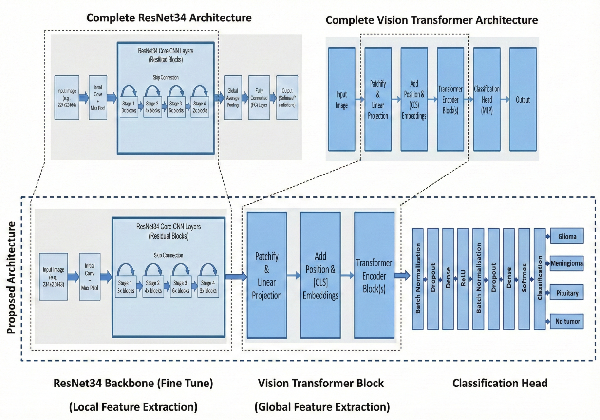
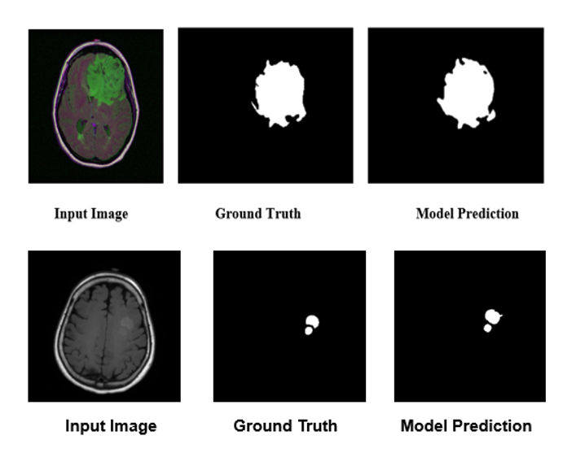

# Automated Diagonosis of Multiple Brain Tumors Using MRI Image Analysis

## Overview

This repository contains the implementation of my Final Year Project, **Automated Diagonosis of Multiple Brain Tumors Using MRI Image Analysis**. The project presents a two-stage deep learning framework for automated brain tumor diagnosis using MRI images.

The proposed system first **classifies brain MRI scans** into multiple tumor categories using a hybrid **ResNet34 + Vision Transformer (ViT)** model. The predicted tumor class is then passed to a **hybrid encoder–decoder segmentation network** for accurate tumor localization.

---

## Project Objectives

* Automatically classify multiple brain tumors from brain MRI images.
* Accurately segment tumor regions with precise boundary localization.
* Reduce manual diagnosis effort and assist clinical decision-making.
* Improve diagnostic performance using deep learning techniques.
* Provide a complete end-to-end automated diagnosis framework.

---

## Project Pipeline

```text
Brain MRI Image
        │
        ▼
 Image Preprocessing
        │
        ▼
 Brain Tumor Classification
 (Hybrid ResNet34 + ViT)
        │
        ▼
 Predicted Tumor Class
        │
        ▼
 Brain Tumor Segmentation
(Hybrid Encoder–Decoder Network)
        │
        ▼
 Segmentation Mask + Boundary Map
```

---

## Brain Tumor Classification

### Model Overview

The classification module employs a **hybrid ResNet34 + Vision Transformer (ViT) with Custom Classification Head** architecture.

The model combines the strong local feature extraction capability of **ResNet34** with the global contextual learning ability of the **Vision Transformer**. ResNet34 extracts hierarchical features from MRI images, while the Vision Transformer captures long-range dependencies among image patches, leading to improved multi-class brain tumor classification.

### Key Features

* Hybrid CNN + Vision Transformer architecture
* ResNet34 backbone for feature extraction
* Vision Transformer for global contextual learning
* End-to-end deep learning framework
* Multi-class brain tumor classification
* Robust performance on brain MRI images

---

## Classification Performance

| Metric                      | Value      |
| ---------------------------- | ---------- |
| **Classification Accuracy** | **99.00%** |

---

## Classification Dataset

The classification model was developed using the **Brain Tumor MRI Dataset** compiled by **Masoud Nickparvar**. This publicly available dataset contains **7,023 brain MRI images** belonging to four categories:

* Glioma
* Meningioma
* Pituitary Tumor
* No Tumor

### Dataset Split

| Dataset    | Number of Images |
| ---------- | ---------------: |
| Training   |            5,712 |
| Validation |            1,142 |
| Testing    |            1,311 |
| **Total**  |        **7,023** |

**Dataset Link:**
[https://www.kaggle.com/datasets/masoudnickparvar/brain-tumor-mri-dataset](https://www.kaggle.com/datasets/masoudnickparvar/brain-tumor-mri-dataset/versions/1)

> **Note:** Prior to training, the MRI images were preprocessed and augmented to improve the robustness and generalization capability of the proposed classification model.

---

## Model Architecture

> <p align="center">
  
</p>

<p align="center"><b>Figure 1.</b> Proposed ResNet34 + Vision Transformer architecture.</p>

---

## Classification Results

### Training & Validation Accuracy

> <p align="center">
  
</p>

<p align="center"><b>Figure 2.</b> Training and Validation Accuracy.</p>

---

### Training & Validation Loss

> <p align="center">
  
</p>

<p align="center"><b>Figure 3.</b> Training and Validation Loss.</p>

---

### Confusion Matrix

> <p align="center">
  
</p>

<p align="center"><b>Figure 4.</b> Confusion Matrix.</p>

---

## Brain Tumor Segmentation

### Model Overview

The segmentation module utilizes a **hybrid encoder–decoder architecture** that integrates **Residual Blocks**, **Rough Set Refinement (RSR)**, and a **Vision Transformer (ViT)** for accurate brain tumor segmentation.

The **ViT bottleneck** captures global contextual information, while **uncertainty-guided skip connections** and **attention gates** enhance feature fusion and improve tumor boundary localization.

The model generates both **segmentation masks** and **boundary maps**, and is optimized using a combination of:

* Dice Loss
* Focal Tversky Loss
* Boundary Loss

This design enables accurate segmentation of complex brain tumor structures.

---

## Segmentation Performance

| Metric             | Value      |
| ------------------- | ---------- |
| **Dice Score**     | **0.9547** |
| **Pixel Accuracy** | **99.88%** |

---

## Segmentation Results

> <p align="center">
  
</p>

<p align="center"><b>Figure 4.</b> Segmentation Output.</p>

---

## Technologies Used

* Python
* PyTorch
* NumPy
* Pandas
* Scikit-learn
* Matplotlib

---

## Research Status

### Brain Tumor Classification

**Paper Status:**  Rohit Khanra, Niladri Khamaru, Ankur Sadhya, and Amiya Halder: **"Brain MRI Multi-Classification Using a Fine-Tuned ResNet-34 Model with Vision Transformer"**, 6th International Conference on Computer Vision and Robotics (CVR2026), NIT Goa.

---

### Brain Tumor Segmentation

**Paper Status:** Under research and manuscript preparation.

The complete segmentation architecture and implementation details will be released after the publication process is completed.

---

## Future Work

* Develop a web-based application for automated diagnosis.
* Extend the framework to additional neurological disorders.
* Improve inference speed for real-time clinical applications.
* Incorporate Explainable AI (XAI) techniques to enhance model interpretability.

---

## Citation

If you use this work in your research, please cite the corresponding publication once it becomes available.

---

## Contact

**Author:** *Your Name*

**Email:** *[your-email@example.com](mailto:your-email@example.com)*

**GitHub:** *https://github.com/your-username*
